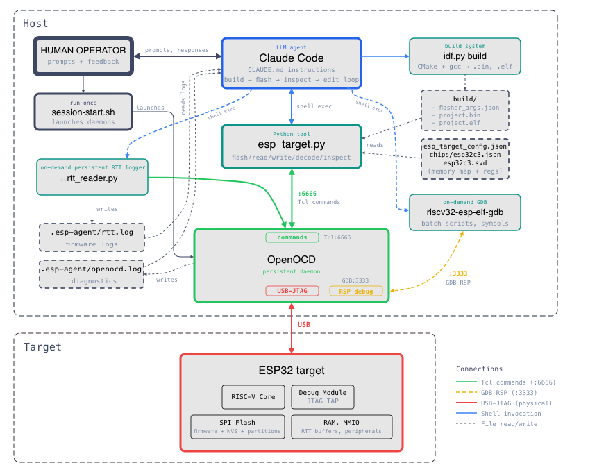
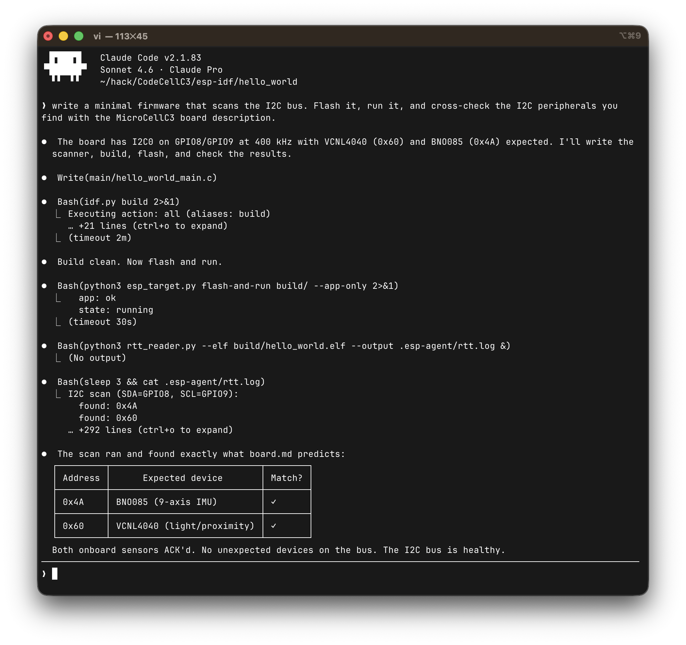

# esp-agentic-dev

**A pure-JTAG development framework for ESP32, designed for agentic coding assistants.**

Designed to give LLM coding agents like [Claude Code](https://code.claude.com) full autonomous control over the develop → flash → inspect → edit loop. Build, flash, inspect, and debug ESP32 firmware entirely over JTAG. For ESP32 devices with built-in JTAG support (e.g., ESP32-C3), no additional debug hardware is required.

## Design

Everything routes through a single interface: OpenOCD over JTAG.

- **Target control** is a single Python tool (`esp_target.py`) for erasing, flashing, resetting, halting, resuming, and inspecting the target
- **Flashing** goes through OpenOCD’s JTAG flash programmer (`program_esp`)
- **Register inspection** uses SVD-aware named peripheral access with bitfield decode
- **Debugging** uses GDB over OpenOCD’s RSP port
- **Logging** uses [SEGGER RTT](https://www.segger.com/products/debug-probes/j-link/technology/about-real-time-transfer/) — a shared-memory ring buffer read via JTAG debug access, no UART involvement

With a single stable control point, the agent can concurrently:

- Flash new firmware without switching interfaces
- Stream plain-text firmware logs while inspecting peripheral registers
- Read memory non-intrusively while the CPU runs
- Halt, inspect CPU state, and resume without disrupting the log stream
- Launch GDB for symbol-aware debugging alongside all of the above

This level of observability — seeing both application output and hardware
state at the same time, through the same transport — is what makes
autonomous firmware development practical. The agent doesn’t need to
guess what went wrong; it can look.

Everything is controlled by command-line tools that an LLM agent can
invoke directly. No IDE, no GUI, no interactive prompts. For detailed
implementation decisions see
[docs/design-decisions.md](docs/design-decisions.md).

## Architecture

```
Claude Code (or any agent)
  ├── idf.py build                    → compile firmware
  ├── esp_target.py (shell exec)      → flash, reset, inspect registers
  ├── GDB batch scripts (on-demand)   → symbol-aware debugging
  ├── reads .esp-agent/rtt.log        → firmware log output
  └── reads .esp-agent/openocd.log    → infrastructure diagnostics

OpenOCD (persistent daemon)
  ├── Tcl :6666    — commands from tools
  ├── GDB :3333    — on-demand debugging
  └── USB-JTAG     → ESP32 target

esp_target.py
  └── OpenOCD Tcl port (:6666)        → mww/mdw, program_esp, halt/resume

rtt_reader.py (background daemon)
  └── OpenOCD Tcl port (:6666)        → polls RTT ring buffer via mdw/mww
```



## Quick start

### 1. Clone

```bash
git clone https://github.com/ccattuto/esp-agentic-dev.git
```

### 2. Set up your ESP-IDF project

Copy the tools and config into your project:

```bash
cd your-esp-idf-project

# Copy tools
cp esp-agentic-dev/tools/esp_target.py .
cp esp-agentic-dev/tools/svd_parser.py .
cp esp-agentic-dev/tools/rtt_reader.py .

# Copy templates
cp esp-agentic-dev/templates/CLAUDE.md .
cp esp-agentic-dev/templates/esp_target_config.json .
cp esp-agentic-dev/templates/esp-session-start.sh .
cp esp-agentic-dev/templates/esp-session-stop.sh .
chmod +x esp-session-start.sh esp-session-stop.sh

# Copy chip config
mkdir -p chips
cp esp-agentic-dev/chips/esp32c3.json chips/

# Provide board configuration, or copy it from boards/
cp esp-agentic-dev/boards/codecellc3.md board.md
```

### 3. Get the SVD file

Download the CMSIS SVD for your chip from [Espressif's SVD repo](https://github.com/espressif/svd):

```bash
curl -L -o chips/esp32c3.svd \
    https://raw.githubusercontent.com/espressif/svd/main/svd/esp32c3.svd
```

### 4. Edit the config

Edit `esp_target_config.json` to match your setup. The defaults work for
ESP32-C3 with built-in USB-JTAG:

```json
{
  "chip": "chips/esp32c3.json",
  "openocd": {
    "board_cfg": "board/esp32c3-builtin.cfg",
    "flash_command": "program_esp",
    "tcl_port": 6666,
    "gdb_port": 3333,
    "telnet_port": 4444
  },
  "gdb": {
    "executable": "riscv32-esp-elf-gdb-no-python"
  },
  "logging": {
    "method": "rtt"
  }
}
```

Edit `board.md` to describe your specific development board
— pin assignments, LEDs, buttons, I2C/SPI buses, and any hardware constraints.
This gives the agent the context it needs to write correct pin
configurations and peripheral initialization code.

### 5. Start a session
 
**You (human) — activate the ESP-IDF environment and start the infrastructure::**
 
```bash
. $IDF_PATH/export.sh   # if not already active in this shell

./esp-session-start.sh
 
python3 esp_target.py health
# → {"ok": true, "state": "running", "chip": "ESP32-C3", ...}
```
 
**You (human) — launch the agent:**
 
```bash
claude   # or your preferred agentic coding tool
```
 
**The agent takes it from here** — building, flashing, reading logs,
inspecting registers, editing code. Typical actions taken by the agent look like:
 
```bash
# Agent builds
idf.py build
 
# Agent flashes
python3 esp_target.py flash-and-run build/ --app-only
 
# Agent starts log capture (if firmware has RTT)
python3 rtt_reader.py --elf build/project.elf --output .esp-agent/rtt.log &
 
# Agent reads firmware output
cat .esp-agent/rtt.log
 
# Agent inspects hardware state
python3 esp_target.py decode GPIO.OUT
 
# Agent edits code, repeats
```
 
**You (human) — when done:**
 
```bash
./esp-session-stop.sh
```



## Adding RTT to your firmware

### 1. Get SEGGER RTT sources

Download `SEGGER_RTT.c`, `SEGGER_RTT.h`, and `SEGGER_RTT_printf.c` from
[SEGGER's website](https://www.segger.com/products/debug-probes/j-link/technology/about-real-time-transfer/).
Copy them into your `main/` component directory.

### 2. Use the patched config header

Copy the `SEGGER_RTT_Conf.h` from this repository's `rtt/` directory. It adds
RISC-V interrupt lock macros (`csrrci`/`csrw` on `mstatus` MIE bit), guarded
by `#if defined(__riscv)`. ARM targets use the stock PRIMASK/BASEPRI macros
unchanged.

### 3. Update CMakeLists.txt

```cmake
idf_component_register(
    SRCS "SEGGER_RTT.c" "SEGGER_RTT_printf.c" "your_main.c"
    PRIV_REQUIRES spi_flash
    INCLUDE_DIRS "."
)
```

### 4. Write to RTT in your code

```c
#include "SEGGER_RTT.h"

void app_main(void) {
    SEGGER_RTT_WriteString(0, "Boot complete\n");
    while (1) {
        SEGGER_RTT_printf(0, "tick %d\n", counter++);
        vTaskDelay(pdMS_TO_TICKS(1000));
    }
}
```

## Tools

### esp_target.py

Target control over OpenOCD's Tcl interface. Reads `esp_target_config.json`
automatically.

```bash
# Target state
esp_target.py health              # check connectivity
esp_target.py state               # running / halted
esp_target.py halt                # halt CPU
esp_target.py resume              # resume CPU
esp_target.py reset run           # reset and run

# Flash
esp_target.py flash build/            # full flash (bootloader + partition table + app)
esp_target.py flash build/ --app-only # app only (faster)
esp_target.py flash-and-run build/ --app-only

# Memory
esp_target.py read 0x3FC80000 4           # read 4 words
esp_target.py read 0x3FC80000 16 --width 8 # read 16 bytes
esp_target.py write 0x3FC80000 0xDEADBEEF

# CPU registers (target must be halted)
esp_target.py regs                # all core registers + key CSRs
esp_target.py reg pc              # single register
esp_target.py reg mcause

# SVD-aware peripheral access
esp_target.py list-periph                 # all peripherals
esp_target.py list-regs GPIO              # registers in a peripheral
esp_target.py read-reg GPIO.OUT           # read by name
esp_target.py decode GPIO.OUT             # decode into named bitfields
esp_target.py inspect UART0               # dump all registers of a peripheral
esp_target.py write-reg GPIO.OUT_W1TS 0x400

# Info
esp_target.py memmap              # chip memory map
esp_target.py info                # resolved configuration
esp_target.py raw "targets"       # raw OpenOCD command passthrough
```

### rtt_reader.py

Reads SEGGER RTT ring buffers directly via OpenOCD memory access. Runs as
a background process, streams firmware log output to a file or stdout.

```bash
# Using ELF to locate control block (fast)
rtt_reader.py --elf build/project.elf --output .esp-agent/rtt.log &

# Using known address (instant)
rtt_reader.py --address 0x3fc8d824 --output .esp-agent/rtt.log &

# Scan SRAM for control block (slow, no symbol info needed)
rtt_reader.py --output .esp-agent/rtt.log &

# Just find the control block and print info
rtt_reader.py --elf build/project.elf --scan-only
```

### svd_parser.py

Standalone CMSIS SVD parser using only Python stdlib. Used internally by
`esp_target.py`. Supports the full SVD schema: peripherals, registers,
clusters, fields, derived peripherals. Caches parsed results as JSON for
fast subsequent loads.

## Using with Claude Code

Copy `CLAUDE.md` from `templates/` into your project root. It contains
complete instructions for the agentic workflow: how to build, flash, read
logs, inspect registers, debug crashes.

Recommended `.claude/settings.json` for permissions:

```json
{
  "allowedTools": [
    "Read",
    "Edit",
    "Write",
    "Bash(python3 esp_target.py:*)",
    "Bash(python3 rtt_reader.py:*)",
    "Bash(idf.py:*)",
    "Bash(riscv32-esp-elf-gdb:*)",
    "Bash(riscv32-esp-elf-gdb-no-python:*)",
    "Bash(riscv32-esp-elf-nm:*)",
    "Bash(riscv32-esp-elf-objdump:*)",
    "Bash(riscv32-esp-elf-addr2line:*)",
    "Bash(cat:*)",
    "Bash(head:*)",
    "Bash(tail:*)",
    "Bash(grep:*)",
    "Bash(ls:*)",
    "Bash(echo:*)",
    "Bash(find:*)",
    "Bash(file:*)",
    "Bash(awk:*)",
    "Bash(sed:*)",
    "Bash(diff:*)"
  ]
}
```

The typical agentic development cycle:

1. Agent edits source code
2. `idf.py build` — agent parses compiler errors, fixes them
3. `esp_target.py flash-and-run build/`
4. Agent reads `.esp-agent/rtt.log` for firmware output
5. Agent inspects hardware state via `esp_target.py decode`, `inspect`, `regs`
6. Agent diagnoses the issue, edits code, repeats

## Supported chips

| Chip | Config | Tested | Notes |
|------|--------|--------|-------|
| ESP32-C3 | `chips/esp32c3.json` | Yes | Built-in USB-JTAG |

Adding a new chip requires:
1. A chip JSON file with the memory map (see `chips/esp32c3.json` as reference)
2. An SVD file from [Espressif's SVD repo](https://github.com/espressif/svd)
3. Updated `esp_target_config.json` with the correct board config, flash command, and GDB executable

The tools are chip-agnostic — only the config files change. Contributions
of new chip configs are welcome.

## ESP-IDF apptrace (alternative logging)

For capturing all ESP-IDF internal logging (WiFi, BLE, RTOS, driver
output), the ESP-IDF apptrace mechanism can redirect `ESP_LOGx` output
over JTAG. See the [CLAUDE.md template](templates/CLAUDE.md) for setup
instructions.

Key tradeoff: apptrace captures everything automatically but blocks
OpenOCD during capture and produces binary output requiring a decode
step. RTT is better for the continuous agentic loop; apptrace is better
for deep diagnostic sessions.

## Requirements

- Python 3.8+
- [ESP-IDF](https://docs.espressif.com/projects/esp-idf/en/latest/esp32/get-started/) (for building firmware)
- OpenOCD with Espressif support (installed with ESP-IDF)
- An ESP32 board with JTAG access (built-in USB-JTAG or external probe)

No additional Python packages are needed — all tools use stdlib only.

The ESP-IDF environment must be active in your shell before starting a session.
If `idf.py` and `openocd` are not on your PATH:

```bash
. $IDF_PATH/export.sh
```

This must be done in the same shell where you run `esp-session-start.sh` and `claude`.
The session script and the agent inherit the shell environment — if the toolchain isn't on PATH, nothing works.

## License

[MIT](LICENSE)

## Contributing

Contributions welcome. The most useful additions are:

- Chip configs for other ESP32 variants (S2, S3, C6, H2)
- Testing on different host platforms (Linux, Windows WSL)
- Integration with other agentic coding tools beyond Claude Code
